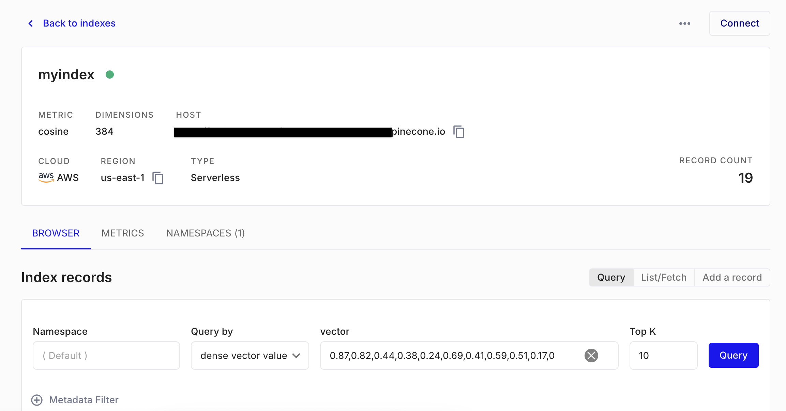
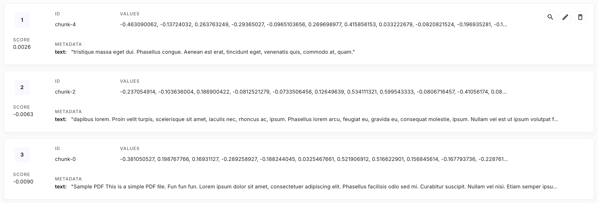

# PDF Query Service with FastAPI and Pinecone

This repository contains a FastAPI-based service that processes a PDF from a given URL, splits it into chunks, stores these chunks in Pinecone, and retrieves the top 5 most similar chunks based on a user-provided query.

## Features

PDF Download and Processing: The service downloads a PDF from a given URL and splits it into manageable chunks.\
Pinecone Integration: The processed chunks are stored in Pinecone for efficient similarity searching.\
Query Retrieval: Users can send a query, and the service will return the top 5 chunks most similar to the query.\
Docker Support: The service can be easily run using Docker. 

## Installation

#### Requirements
First of all your own APIKey from PineCone \
Docker \
Building the Docker Image\
To build the Docker image, navigate to the project directory and run:

```bash
docker build -t pdf-query-service .
```

## Running the Service
You can run the service using Docker:

```bash
docker run -p 8008:8008 pdf-query-service
```

The service will be accessible at http://localhost:8008.

## Usage
You can send a request to the service using curl:

```bash
curl --location 'http://localhost:8008/query_to_pinecone' \
--form 'query="Lorem"' \
--form 'url="https://pdfobject.com/pdf/sample.pdf"'
```

<span style="color:red">*WARNING: Since it embeds and transfers to the 
database in the first request, it may take longer 
depending on the given pdf. Subsequent ones will 
yield much faster results without the need to 
download again.*</span>

This request will:

1. Download the PDF from the provided URL.
2. Split the PDF into chunks.
3. Store the chunks in Pinecone (only on the first download).
4. Return the top 5 chunks most similar to the query.

## Pinecone Database Schema



